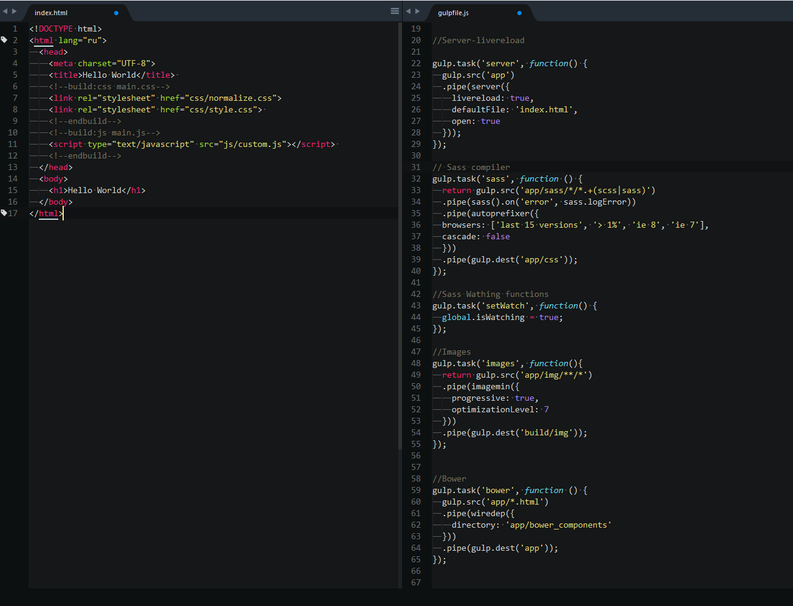

START RESPONSIVE TEMPLATE
==============================
----------

This template is used for fast starting your work. There is included Gulp and Bower. You can automaticaly compile sass/scss, add vendor prefixes, minimize html/css/images/js and build project. All of your changes will be automaticaly and you will see theirs in browser.

## Install
##### If you haven't [NodeJS](https://nodejs.org/), [NPM](https://www.npmjs.com), [GIT](https://git-scm.com/), [Bower](http://bower.io), [Gulp](http://gulpjs.com/) you must install their with global settings first of all.
* Clone the repo: `https://github.com/ivanovnetua/start_html.git`.
* Install [npm](https://www.npmjs.com) in work folder:  `npm inslall`.
* Install with [Bower](http://bower.io) in work folder: `bower install`.

## How use
* Working and watching changes: `gulp work`.
* Build your project: `gulp work`.
* Production: `gulp production`.

## What's included

      app/                  demo
        css/                Compiled css folder
          normalize.css     Clear browsers styles
        img/                Image folder
        js/                 Javascript files folder
          custom.js         Clean custom JS file
        sass/               SASS files folder
          style.sass        Clean custom sass file
        index.html          Hello World html file
      build/                Bilding project folder
      libs/                 Bootstrap, SVG fallback, modernizr
      Resource/             Screenshots for github
      .bowerrc              Bowerrc settings
      .gitignore            Git ignore file
      bower.json            Bower components file
      gulpfile.js           Gulp tasks
      package.json          Gulp packges setting
      readme.md             Description file

## Screenshots

## Author

###**Vladimir Ivanov** ([ivanov.net.ua](https://www.npmjs.com))
